# MS-TCT

## 一、问题与动机（背景）
从未剪辑的长视频中做动作检测，然而这种未剪辑的长视频中涵盖了复杂的时间联系，包括由一系列原子动作组成的复合动作和同时发生的多个原子动作。所以，该问题的核心在于同事捕捉短期和长期的时间信息。
如下图所示，要理解“Take food（拿食物）”这个动作只需认识到前面的“Open fridge（开冰箱）”即可，即两者存在短期联系；而要理解“Make sandwich（做三明治）”这个就需要全部认识到“Take food（拿食物）”、“Close fridge（关冰箱）“、“Put on table（放在桌上）”、“Pour water（倒水）”这一系列动，即两者存在长期联系。
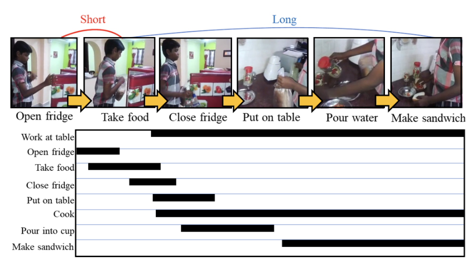

对于短期时间信息建模，之前许多工作采用一维时间卷积（1D Temporal Convolution），然而它的缺点就是忽略了长期的时间联系。对于长期时间信息建模，Transformers无疑是比较好的选择，多头注意力（multi-head self-attention）可以建立全局时间段一对一的联系,但是它却忽略了局部的时间联系（Local inductive bias，局部归纳偏置）。所以，本文的动机是结合convolution的局部建模能力和self-attention的全局建模能力，联合捕捉视频的长-短期时间信息。

## 二、解决方案

如上图所示，本文提出了一种Multi-Scale Temporal ConvTransformer(MS-TCT)网络结构，它由四部分组成：Visual Encoder 、Temporal Encoder、Temporal Scale Mixer和Classification Module。该模型主要流程如下：
1、将视频均分为T段并在每段密集采样8帧作为Visual Encoder(默认为I3D)的输入。
2、Visual Encoder提取到视觉特征后通过全局平均池化得到1D 的时间Token作为Temporal Encoder的输入。
3、Temporal Encoder采用多个Stage对多尺度的时间信息建模，各Stage输出特征图的时间分辨率减半但特征维度翻倍，这种结构使得TE早期stage能够学习到原子动作间细粒度的联系，晚期stage学习到复合动作的粗糙联系。（类似ResNet 残差网络）
4、Temporal Scale Mixer的作用是将各Stage输出的时间多尺度特征图融合，获得一个具有局部视野和全局视野的统一表示。（类似FPN 特征金字塔网络）
5、Classification Module具有两个分支，其中一个分支对TS Mixer融合后的特征计算分类概率（BCE Loss），另外一个分支对TS Mixer融合后的特征预测动作热力图，用于感知各个类别动作的相对位置（Focal Loss）。注意，模型在预测时不用heat-map 分支。

### （一）Visual Encoder阶段
将视频均分为T段，每段取8帧作为关键帧，作为Encoder的输入，Visual Encoder的主干网络是I3D网络（双流膨胀3D卷积网络）。
#### （1）双流膨胀3D卷积网:
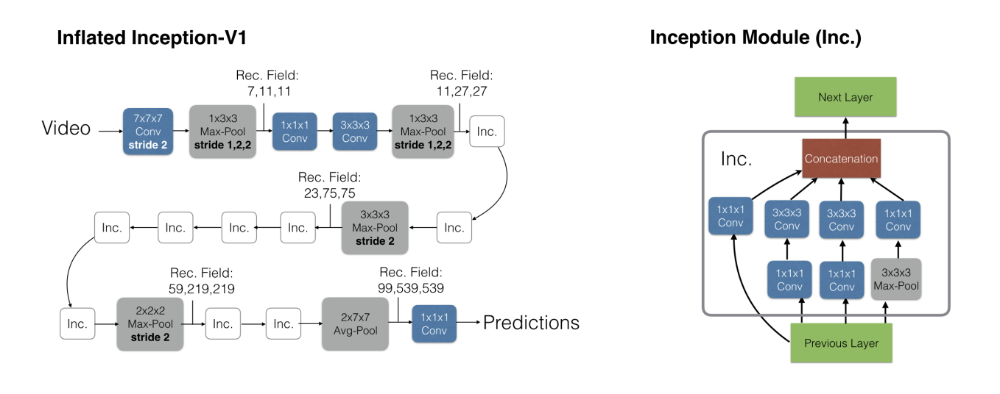

I3D主要应对的是剪辑视频的动作识别，将卷积核从二维扩展到了三维，可以学习时间维度的特征。通常使用I3D提取双流特征（RGB流与光线流，本文主要使用RGB流），得到的结果会好一些，一方面主要因为网络结构更深，另一方面使用3d卷积核，将时序信息包含进来，能提取更完备的视频特征（除去最后的预测部分）。
	
	每一个视频段（8帧的图片）经过I3D网络后形成一个的token，最终组合成一个的Tokens。可以理解为这个模块把一个视频分成多个视频片段，每个token代表一个视频片段的特征。
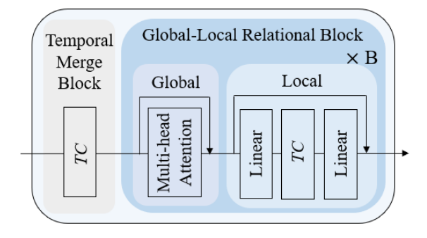

### （二）Temporal Encoder 

Temporal Encoder是由4个Stage组成，每个Stage包含Temporal Merge Block和Global-Local Relational Block组成。上图是Temporal Encoder中的一个Stage。
	（1）时间融合模块（TMB）：是一个时间卷积层（Temporal Convolution），使用1D Conv实现，作用是减小时间分辨率的同时扩增特征维度，相当于一个时间下采样模块。
	（2）全局-局部关系模块（GLRB）：本文提到的利用卷积以及自注意力机制的优点的具体表现
全局模块采用多头自注意力机制学习全局联系。
局部模块采用时间卷积学习局部联系，Local中TC前后各有一个线性层，前者是扩张维度，后者是缩小维度，及倒残差结构，其目的是增强TC部分的特征提取能力。
注：文章提到Linear是一个核为1的1d Conv，代码中是线性变换

### （三）Temporal Scale Mixer 

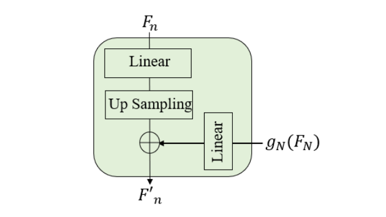

设每个Stage的输出为 ，Fn，n∈{1,2,...,N} ，为了实现每个Stage的输出都有相同的时间分辨率，需要对它们进行上采样，该操作定义为：

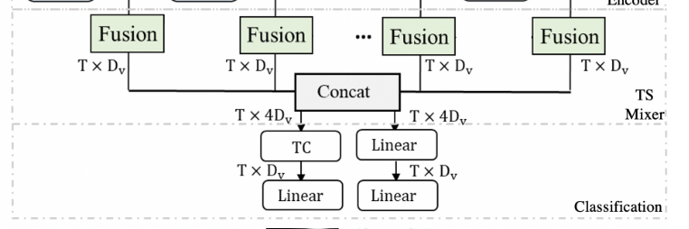

设最后一个阶段的特征图上采样后为  使得最后一个阶段的特征图向所有低层特征图融合后沿着特征维度拼接气啦，具体定义如下：

TSM的结构与FPN（特征金字塔）类似，又有不同。TSM直接使用最后Stage的特征图向前的各个阶段融合。作者在论文中讲到实现特征融合有很多复杂的方式，但是实验发现这个简单的结构性能最好。
注：论文与代码有出入，左侧的输出没有用到进行特征融合

### （四）Classification Module
分类模块由分类器与热力图两部分组成。分别输出一个T * C的矩阵 T代表视频均分的T段，C代表类别种类。
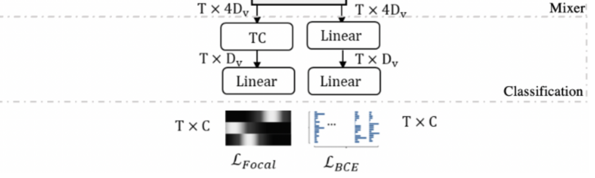

为什么不用Softmax作为分类器，是因为某段视频可能包含多种动作。

(1)分类器：
对C种种类进行二分类。
由两个线性层（代码中为两个卷积核大小为1的1d Conv层）组成。
损失函数用的是二分类交叉熵函数
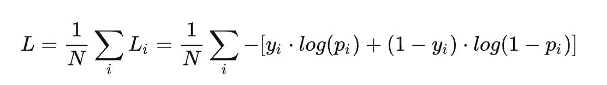

(2)热力图：
	为了对各个类别在时间上的相对位置编码，每个类别在时间上的分布是不同的，需要感知某个侗族奥在时间上的中心位置，利于确定它的边界。所以热力图本质上是一个可学习的位置编码。
	由一个TC层一个线性层（分别为卷积核大小为3和1的Conv层）组成，中间夹一个非线性激活函数（ReLu）
	Ground truth（训练正向样本）服从高斯分布，损失函数也是基于预测的中心位置计算其高斯分布。设 表示实体a和类别c的中心位置，那么它的高斯分布可以计算为：
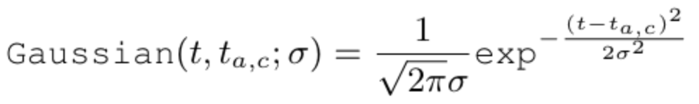	
由于视频中可能有多个实体做了相同的动作但中心位置不同，那么热力图的标签 G∗ 可计算为：
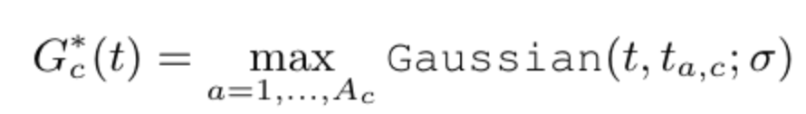
假设有两个实体在不同时间节点上做了相同的动作。

对两者计算Max得到 G∗

热力图的损失函数为：

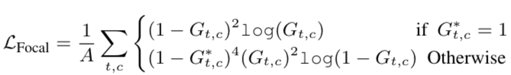

Focal Loss：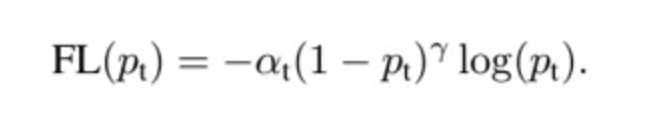

	该函数是在原有的交叉熵函数进行改进的
与分别为超参，被称为调制系数。
目的是通过减少易分类样本的权重，从而使模型在训练时更专注于难分类的样本。当一个样本被分错的时候，Pt是很小的所以(1-Pt)接近于1，损失基本不被影响。反之，当Pt接近1的时候(1-Pt)接近0，那么well-classified样本的权值就被调低了。
用来控制正负样本的权重，目标检测问题中，正样本数量往往远低于负样本，为了平衡正负样本对总损失的权重，通常取比较小的值来降低负样本的权重。

	最后，分类模块的最终损失函数为
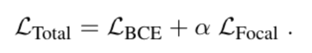

## 三、实验
消融实验：

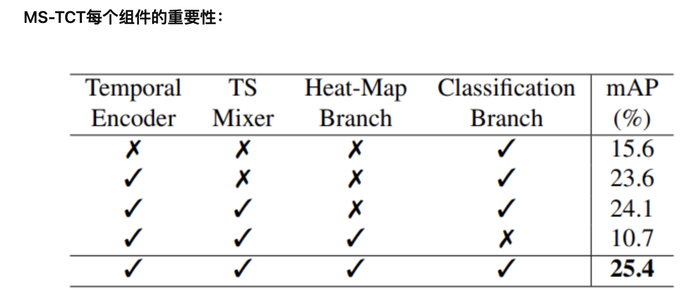

本文提出的ConvTransformer并没有在输入端引入位置编码，而self-attention是对相对位置不敏感的。然而，heat map分支通过有监督的方式让模型学习的动作中心分布，能够更好的确定动作的时间边界，对于动作检测任务更加适应。

## 四、总结
1、提出ConvTransformer将self-attention的全局偏好和convolution的局部偏好结合在一起。
2、提出heat-map分支使得模型学习动作发生的中心位置，有利于动作的边界确定。
3、采用多尺度+融合结构使得模型学习到了多尺度的时间信息。

